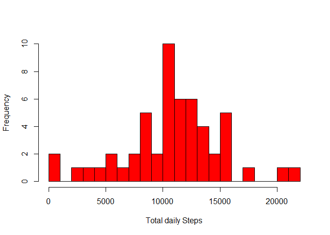
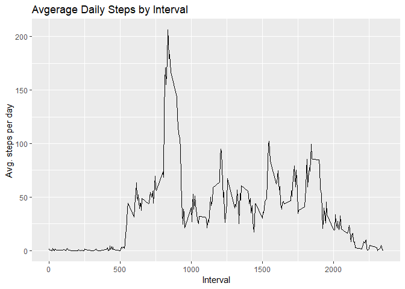
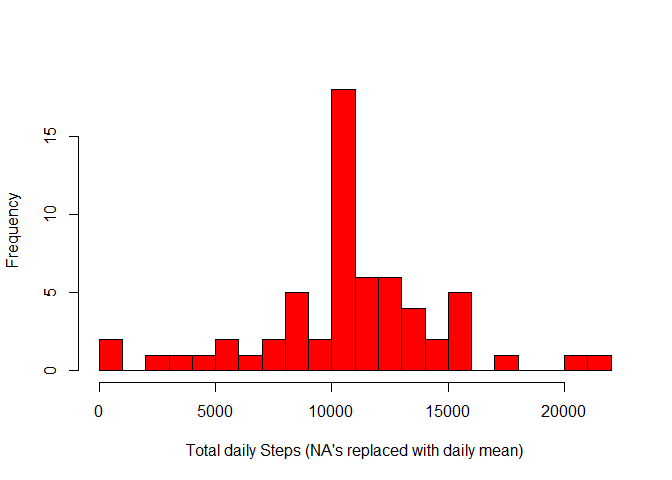
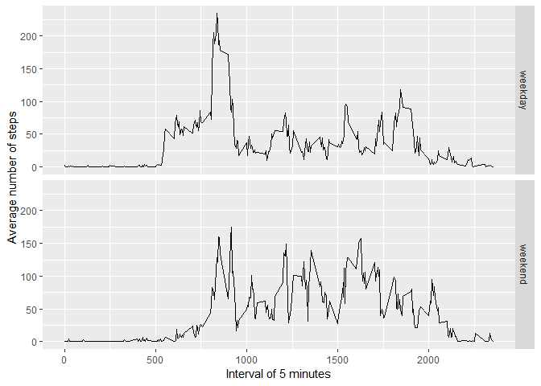

Coursera Reproducible Research  
Peer Assessment 1  
Jani Savolainen  


## Loading and preprocessing the data

```r
fileUrl <- "https://github.com/zavolainen/RepData_PeerAssessment1/raw/master/activity.zip"
fileName <- "activity.zip"

# download data file if it does not exist
if (!file.exists(fileName)) {
        download.file(fileUrl, fileName, mode = "wb")
}

# unzip data file if data directory doesn't exist
dataPath <- "activity"
if (!file.exists(dataPath)) {
        unzip(zipFile)
}

data <- read.csv("./activity/activity.csv")
```


## What is mean total number of steps taken per day?

```r
# Sum the steps by date and draw a histogram #
aggStepsDay <- aggregate(steps ~ date, data, sum, na.rm=TRUE)
hist(aggStepsDay$steps,  xlab = "Total daily Steps", ylab = "Frequency", main = "", breaks = 25, col = "red", border = "black")
```

<!-- -->

```r
meanStepsDay <- format(as.numeric(mean(aggStepsDay$steps)), scientific = FALSE)
medianStepsDay <- format(as.numeric(median(aggStepsDay$steps)), scientific = FALSE)
```

**MEAN** of the total number of steps taken per day is 10766.19 and  
**MEDIAN** of the total number of steps taken per day is 10765.  


## What is the average daily activity pattern?


```r
library(ggplot2)

# sum the steos by interval and draw a line graph #
aggStepsInt <- aggregate(steps ~ interval, data = data, FUN = mean, na.rm=TRUE)

stepsIntPlot <- ggplot(data = aggStepsInt, aes(x=interval, y=steps))
stepsIntPlot <- stepsIntPlot + geom_line() + labs(title = "Avgerage Daily Steps by Interval", x = "Interval", y = "Avg. steps per day")
print(stepsIntPlot)
```

<!-- -->

```r
# calculate the interval with most steps #
maxStepsInterval <- aggStepsInt[which(aggStepsInt$steps == max(aggStepsInt$steps)),]
print(maxStepsInterval)
```

```
##     interval    steps
## 104      835 206.1698
```

On average across all the days in the dataset the 5-minute interval which contains the maximum number of steps is interval 835, where there are about 206.1698113 steps on average.  

## Imputing missing values


```r
# calculate the na's #
missingValuesCount <- length(which(is.na(data$steps)))
missingValuesCount
```

```
## [1] 2304
```

Total number of missing values in the dataset is 2304.


```r
# replace na's in steps column with daily average #
replaceNaWithMean <- transform(data, steps = ifelse(is.na(data$steps), 
                aggStepsInt$steps[match(data$interval, aggStepsInt$interval)], data$steps))
sumReplacedData <- aggregate(steps ~ date, replaceNaWithMean, sum, na.rm=TRUE)

# draw a histogram with the replaced NA's #
hist(sumReplacedData$steps,  xlab = "Total daily Steps (NA's replaced with daily mean)", ylab = "Frequency", main = "", breaks = 25, col = "red", border = "black")
```

<!-- -->

```r
# calculate the new mean and median #
oldmean <- meanStepsDay
newmean <- format(as.numeric(mean(sumReplacedData$steps)), scientific = FALSE)

oldmedian <- medianStepsDay 
newmedian <- format(as.numeric(median(sumReplacedData$steps)), scientific = FALSE)
```

The old mean is 10766.19 and the new mean with replaced NA's is 10766.19.  
THe old median is 10765 and the new median with replaced NA's is 10766.19.

Replacing the NA's with daily average number of steps has **no effect on mean** and **very little impact on the median**.

## Are there differences in activity patterns between weekdays and weekends?


```r
# collect the name of the weekday for a new column called weekday and assign weekend/weekday for another new column called weekend#
data$date <- as.Date(data$date)
data$weekday <- weekdays(data$date)
data$weekend <- ifelse(data$weekday=="Saturday" | data$weekday=="Sunday", "weekend", "weekday" )

aggStepsIntDate <- aggregate(steps ~ interval + weekend, data = data, FUN = mean, na.rm=TRUE)

# draw a line graph indicating average steps per interval on during the weekdays and weekends #
weekdayWeekendPlot <- ggplot(data = aggStepsIntDate , aes(x = interval , y = steps)) 
weekdayWeekendPlot <- weekdayWeekendPlot +
                        geom_line() +
                        facet_grid(weekend ~.) +
                        xlab("Interval of 5 minutes") +
                        ylab("Average number of steps")

print(weekdayWeekendPlot)
```

<!-- -->

As we can see from the line plots, during the weekdays and during the weekend the average number of steps in different intervals vary quite a lot.
